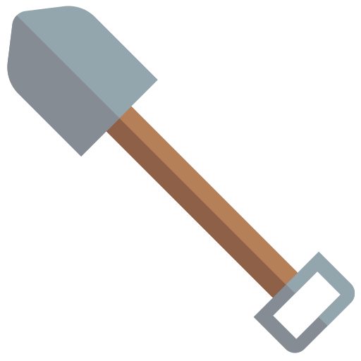

## Archaeology

This is my submission for the [2023 Melvor Idle Mod Contest](https://store.steampowered.com/news/app/1267910/view/3683429000349567517).

[You can view the submission on mod.io here.](https://github.com/Kruithne/melvor_archaeology)

### Design Goals
- Implement a new skill to the game that's rooted in the theme of RuneScape.
- Keep things simple enough that they can be implemented in a short amount of time and don't overwhelm the player.
- Give the skill enough depth that it's not just a "click and forget" skill.
- Expand on the base of an idle skill with some interactive element to add gameplay beyond "having items".
- Avoid touching combat to prevent changing the balance of the game.

### Design Overview
Archaeology is an passive gathering skill that allows you to set-up digsites in various locations. These digsites will generate items over time.

Digsites require an amount of gold and resource to set-up. The associated cost will be higher for the more valuable digsites. Only one digsite can be "active" at a time, in line with most active gathering skills.

During the early levels, most of the items recovered will be junk, similar to how fishing works. These junk items will be themed according to the digsite area. For example, a castle may have you finding broken arrows, whereas a desert digsite you may recover cracked canopic jars.

As you gain mastery on a digsite, the consistency of junk items will decrease and you will find more valuable items. Most of these items will simply be sold for gold, however there are rare items called "Artifacts".

Artifacts sell for more gold by themselves, but also function as part of a collection. The general aim of the skill is to collect all of the artifacts for each digsite. Once you have collected all of the artifacts for a digsite, you will unlock a digsite-specific pet.

In addition, you may also find various unique items from digsites known as "curiosities". One example might be a "Puzzle Box", which requires solving a small puzzle to open it. Inside will be a variety of treasure items.